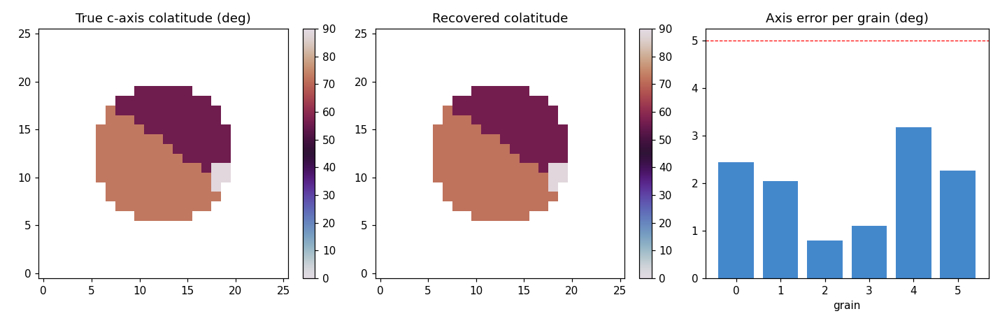
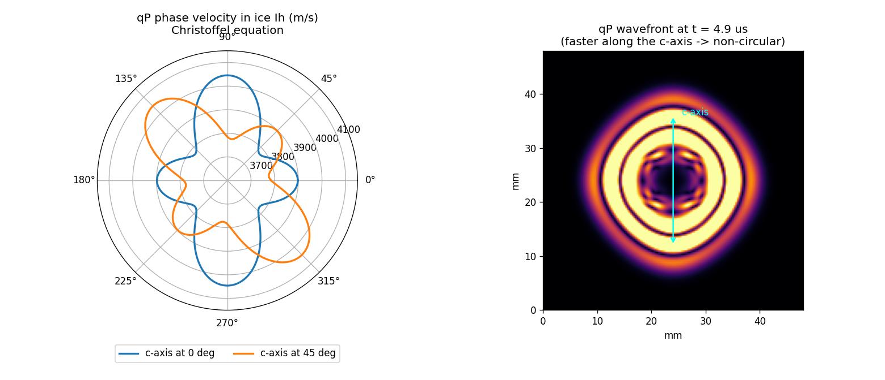
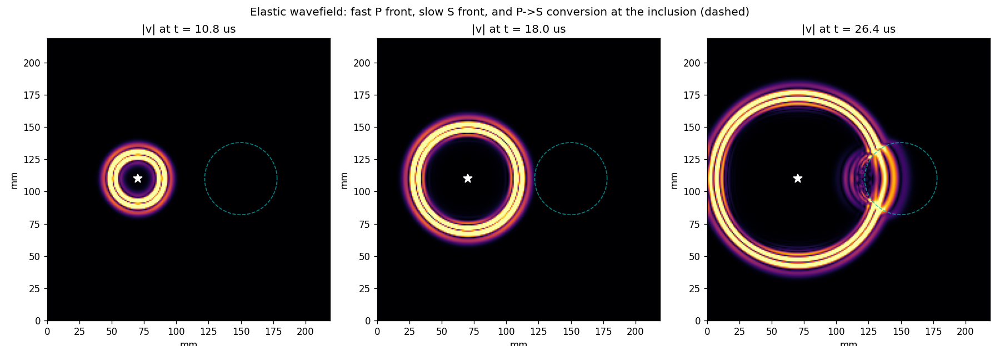

# OpenUSCT

**Open ultrasound computed tomography: full-waveform imaging across hardware,
software, and simulation.**

OpenUSCT (Open Ultrasound Computed Tomography) is an end-to-end, open-source
platform for ultrasound array research and industrial imaging. It reconstructs
the interior of a specimen from full-matrix capture on a ring or cylinder
array by full waveform inversion, no beamforming. It spans three pillars that
are designed as one system:

1. **[Hardware](hardware/)**: a transducer array and acquisition electronics.
   The FPGA datapath (transmit pulser, sequencer, capture, AXI-Stream) is
   written in SystemVerilog and co-simulated bit-exact against the physics.
2. **[Software](software/)**: one processing stack, usable from **Python, C++,
   or MATLAB**, with OpenMP and CUDA (CuPy) acceleration, a common on-disk
   data format, a plugin interface, and a full GUI.
3. **[Simulation](simulation/)**: verified wave-physics solvers (acoustic,
   elastic, and fully anisotropic elastic, 2D and 3D) that produce the same
   data the hardware would, so algorithms are developed and validated in
   software before they touch a board.

## Try it

* **In your browser, on your machine:**
  [jerome-graves.github.io/openUSCT](https://jerome-graves.github.io/openUSCT/).
  The whole app runs client-side (Python compiled to WebAssembly); on Chrome
  or Edge the acoustic acquisition executes on **your GPU via WebGPU**, with a
  live parity check against the CPU reference.
* **Hosted demo (no install, server-side):**
  [open-usct.streamlit.app](https://open-usct.streamlit.app/).
* **Locally, at full speed** (C++ core, CUDA if available):

```bash
pip install -r requirements.txt
streamlit run software/gui/app.py     # http://localhost:8501
```

The GUI drives the complete workflow in tabs: array and transducer geometry
(interactive 3D, finite-aperture elements), the FPGA excitation chain
(discrete pulser drive, TX and RX filters), sample definition (uniform
specimen or a 3D Voronoi polycrystal of anisotropic grains with preset or
custom single-crystal constants), acquisition with an automatic FPGA RTL
capture stage, TFM imaging, and FWI reconstruction with six misfit
functionals and two optimisers.

## The idea that makes it one platform

The three pillars share **one data format and one processing pipeline**. A
simulated acquisition and a real acquisition both produce the same `Dataset`
(array geometry plus full-matrix-capture channel data in a portable HDF5
file), and the same imaging, FWI, and custom-algorithm code runs on either.
The simulator is a digital twin of the hardware, not a separate codebase.

```
   +-------------+      +-------------+
   |  HARDWARE   |      | SIMULATION  |
   | array + PCB |      | wave solver |
   +------+------+      +------+------+
          |   same Dataset     |
          |   (HDF5 schema)    |
          +---------+----------+
                    v
          +--------------------+     Python / C++ / MATLAB / GPU
          |  SOFTWARE  (core)  |<--> user algorithms (plugins)
          | imaging, FWI,      |
          | misfits, optimisers|
          +---------+----------+
                    v
                  image
```

See [docs/architecture.md](docs/architecture.md) and
[docs/roadmap.md](docs/roadmap.md).

## Verified results

Every physics kernel and gradient in the platform carries an explicit
verification, most to machine precision:

| Claim | Evidence |
|---|---|
| Acoustic FWI gradient is the exact discrete adjoint (2D and 3D) | finite-difference check, rel. error ~ 0 |
| C++/GPU backends match the Python reference | parity ~ 1e-15 (C++), ~ 1e-6 (FP32 GPU) |
| Elastic solvers propagate correct P and S speeds | measured against theory, < 5% (dispersion-limited, converges with resolution) |
| Anisotropic solvers (2D and full 21-component 3D) | measured qP against the analytical Christoffel equation, < 1% in 2D, dispersion-limited in 3D with verified convergence |
| Six misfit functionals (L2, GCN, envelope, envelope-GCN, traveltime, graph-space OT) | each adjoint source passes a finite-difference gradient check |
| Gauss-Newton FWI (matrix-free Born + adjoint) | Hessian-vector product matches FD of the gradient to 1e-7; 4 iterations reach 0.03% misfit where gradient descent reaches 8.5% |
| Full-waveform grain-orientation (COF) inversion | recovers every c-axis of an ice polycrystal to 2.0 deg mean error from a blind start |
| FPGA acquisition datapath | RTL streamed capture bit-exact against the simulated acquisition (Icarus Verilog) |

## Highlights

Full-waveform crystal-orientation-fabric inversion: with known grain geometry
and material, the 3D c-axis of every grain in an ice polycrystal is recovered
from one elastic full-matrix capture (mean axis error 2.0 deg, worst 3.2 deg,
including a grain started 90 deg away):



Anisotropic physics verified against theory: the qP phase-velocity surface of
single-crystal ice Ih from the Christoffel equation, and the simulated
non-circular wavefront, faster along the c-axis:



Elastic wave propagation with mode conversion: the fast P front, the slow S
front, and P-to-S conversion at a stiff inclusion, the signal an acoustic
model cannot represent:



Acoustic FWI reconstructions, 2D ring and 3D cylinder arrays:


## Running the tests and examples

Run every test layer available on your machine (skips MATLAB, C++, and CUDA
cleanly if absent):

```bash
python run_tests.py
```

The simulation core alone:

```bash
cd simulation
python -m pytest tests/ -s                 # all gradient and physics checks
python examples/run_fwi_demo.py            # 2D reconstruction
python examples/run_fwi_demo_3d.py         # 3D reconstruction
python examples/run_anisotropy_demo.py     # ice Ih vs Christoffel
python examples/run_elastic_demo.py        # P/S mode conversion
python examples/run_cof_inversion.py       # grain-orientation inversion
```

Rebuild the in-browser bundle after changing the app:

```bash
python web/build_stlite.py                 # writes docs/index.html
```

## Why open

Quantitative array ultrasound (full-matrix capture, total focusing, full
waveform inversion) is powerful but locked inside expensive proprietary
research scanners and closed toolboxes. OpenUSCT aims to give researchers and
industry a complete, inspectable, extensible reference: a real acquisition
front-end, a processing stack in the language they already work in, and a
verified simulator to prototype against. Applications include non-destructive
testing, ultrasound computed tomography, and cylindrical-specimen imaging
such as ice cores (crystal-orientation-fabric estimation).

## Independence and the UARP format

OpenUSCT is an independent, clean-room project. It is **not affiliated with,
or endorsed by**, the Ultrasound Array Research Platform (UARP) or the IRASS
Ultrasound Research Group at the University of Leeds. OpenUSCT reads and
writes the UARP/UDSP data format for interoperability (conforming to the
published schema), but it contains none of their source code and is not
derived from their software.

## License

MIT. See [LICENSE](LICENSE).
