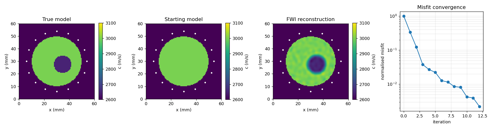
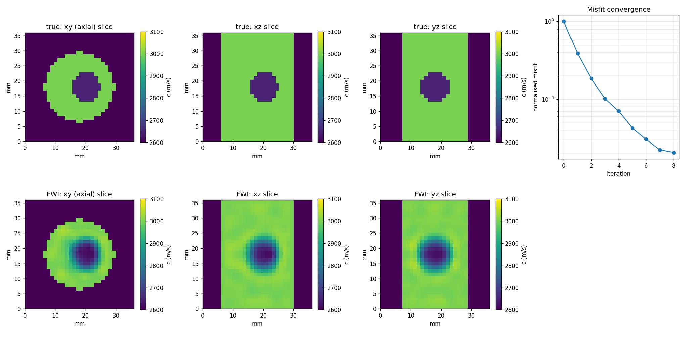

# OpenUSCT

**Open ultrasound computed tomography: full-waveform imaging across hardware,
software, and simulation.**

OpenUSCT (Open Ultrasound Computed Tomography) is an end-to-end, open-source
platform for ultrasound array research and industrial imaging. It reconstructs
the sound speed of a specimen from full-matrix capture on a ring or cylinder
array by full waveform inversion, no beamforming. It spans three pillars that
are designed as one system:

1. **[Hardware](hardware/)** — a transducer array and a custom acquisition PCB
   (electronics in KiCad), with the fixture and immersion tank that hold it
   (parametric mechanical design). It transmits, captures the raw channel data,
   and streams it to a host.
2. **[Software](software/)** — one processing stack, usable from **Python, C++,
   or MATLAB**. A performant C++ core with thin language bindings, a common
   on-disk data format, and a plugin interface for custom algorithms.
3. **[Simulation](simulation/)** — a full wave-physics simulator that produces
   the same data the hardware would, so algorithms can be developed and
   validated in software before they ever touch a board.

## The idea that makes it one platform

The three pillars share **one data format and one processing pipeline**. A
simulated acquisition and a real acquisition both produce the same `Dataset`
(array geometry plus full-matrix-capture channel data in a portable HDF5 file),
and the same beamforming, FWI, and custom-algorithm code runs on either. The
simulator is a digital twin of the hardware, not a separate codebase.

```
   ┌─────────────┐      ┌─────────────┐
   │  HARDWARE   │      │ SIMULATION  │
   │ array + PCB │      │ wave solver │
   └──────┬──────┘      └──────┬──────┘
          │   same Dataset     │
          │   (HDF5 schema)    │
          └─────────┬──────────┘
                    ▼
          ┌───────────────────┐     Python / C++ / MATLAB
          │  SOFTWARE  (core) │◄──► user algorithms (plugins)
          │ DSP · beamforming │
          │ FWI · imaging     │
          └─────────┬─────────┘
                    ▼
                  image
```

See [docs/architecture.md](docs/architecture.md) for the full design and
[docs/roadmap.md](docs/roadmap.md) for the phased plan.

## Status

| Pillar | State |
|---|---|
| Simulation | **Working core.** Dimension-general (2D and 3D) acoustic FWI with an exact, machine-precision-verified adjoint gradient; end-to-end 2D and 3D reconstruction demos; portable HDF5 dataset format. |
| Software | Python reference complete (imaging, FWI, plugins, pipeline). **C++ `libuap` core with Python (pybind11) and MATLAB (MEX) bindings built and verified to machine precision**, several times faster; native C++ builds via CMake. A **pure-Python GUI** (`software/gui`, Streamlit) drives the whole workflow with no MATLAB. |
| Hardware | Electronics and mechanical specifications defined (KiCad and parametric CAD to be built). **FPGA acquisition subsystem written in SystemVerilog and co-simulated against the physics** (transmit pulser, sequencer, capture, AXI-Stream), verified bit-exact in Icarus Verilog. |

The **whole loop is demonstrated end to end in simulation, with RTL at both
ends** (`hardware/fpga/sim/run_grand_cosim.py`): FPGA pulser (RTL) -> transducer
-> acoustic wave -> forward propagation -> RTL capture + AXI-Stream -> UARP/UDSP
file -> FWI reconstruction.

Run every test layer available on your machine (skips MATLAB / C++ / GPU cleanly
if absent):

```bash
python run_tests.py
```

Launch the GUI (pure Python, no MATLAB):

```bash
pip install -r software/gui/requirements.txt
streamlit run software/gui/app.py     # http://localhost:8501
```

The simulation core already runs today:

```bash
pip install -r requirements.txt
cd simulation
python examples/run_fwi_demo.py      # 2D reconstruction -> simulation/figures/
python examples/run_fwi_demo_3d.py   # 3D reconstruction (a few minutes)
python -m pytest tests/ -s           # 2D and 3D adjoint gradient checks
```

2D reconstruction:



3D reconstruction (three orthogonal slices through the recovered flaw):



## Why open

Quantitative array ultrasound (full-matrix capture, total focusing, full
waveform inversion) is powerful but locked inside expensive proprietary research
scanners and closed toolboxes. OpenUSCT aims to give researchers and industry a
complete, inspectable, extensible reference: a real acquisition front-end, a
processing stack they can use in the language they already work in, and a
simulator to prototype against. Applications include non-destructive testing,
ultrasound computed tomography, and cylindrical-specimen imaging such as ice
cores.

## Independence and the UARP format

OpenUSCT is an independent, clean-room project. It is **not affiliated with, or
endorsed by**, the Ultrasound Array Research Platform (UARP) or the IRASS
Ultrasound Research Group at the University of Leeds. OpenUSCT reads and writes
the UARP/UDSP data format for interoperability (conforming to the published
schema), but it contains none of their source code and is not derived from their
software.

## License

MIT. See [LICENSE](LICENSE).
