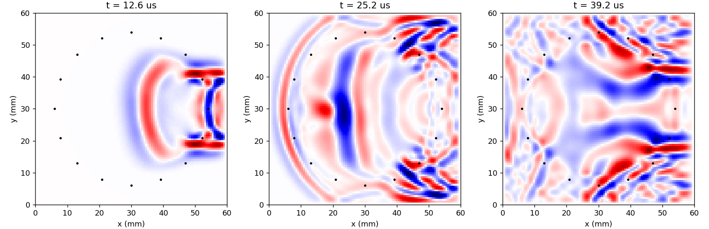
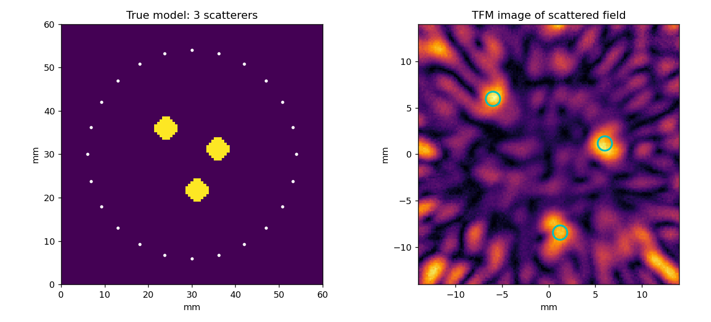

# Simulation pillar

**Full waveform inversion for ring-array ultrasound tomography (2D and 3D).**

This is the simulation pillar of OpenUSCT. It reconstructs the internal
sound-speed map of a cylindrical specimen from ultrasound recorded on an array
of transducers around it, using full waveform inversion (FWI): it simulates the
full wave physics with a finite-difference solver, compares the simulated
waveforms against the measured ones, and iteratively updates the sound-speed
image until the two agree. The result is a quantitative image of what is inside
the specimen, including flaws and inclusions, from transmission and scattering
data alone.

The solver is dimension-general: a planar ring images a 2D slice, and a
cylindrical array of stacked rings images a full 3D volume.

The 2D demonstration places a small low-velocity flaw inside a specimen, records
a full-matrix-capture dataset on a 16-element ring, and recovers the flaw
starting from a model that does not contain it. The misfit falls by three orders
of magnitude and the flaw appears in the correct location.


The 3D demonstration uses a cylindrical array and recovers a spherical flaw,
shown here as three orthogonal slices through the reconstructed volume:


Wave propagation through the 2D specimen, one transmitting element firing:



## Why this exists

Ring-array tomography with full waveform inversion is the state of the art in
quantitative ultrasound imaging. The same geometry appears across fields:

- **Non-destructive testing (NDT):** circumferential inspection of pipes, bars,
  and cylindrical components for cracks, porosity, and inclusions.
- **Ultrasound computed tomography (USCT):** sound-speed and attenuation imaging
  of specimens placed inside a transducer ring.
- **Ice-core and geophysical imaging:** characterising cylindrical cores, where
  the directional variation of wave speed encodes material structure.

Most textbook ultrasound imaging uses delay-and-sum beamforming, which assumes a
constant background speed and produces a qualitative reflectivity image. FWI
instead solves the wave equation and inverts for the actual physical property
map, so it resolves quantitative sound speed and separates a slow flaw from a
fast one. That extra power costs a heavy forward model and an accurate gradient,
which is what this repository implements and verifies.

## Method

- **Forward model.** Second-order-in-time, second-order-in-space leapfrog
  integration of the acoustic wave equation, written in squared-slowness form
  `m d2p/dt2 = laplacian(p) + f` with `m = 1 / c^2`. This operator is
  self-adjoint, which keeps the adjoint stencil identical to the forward one.
  The same code path runs in 2D (planar ring) and 3D (cylindrical array).
- **Acquisition.** The array performs full-matrix capture: each element
  transmits in turn while every element records, giving an N-by-N multistatic
  dataset. A planar ring images a slice; a stack of rings images a volume.
- **Inversion.** Adjoint-state FWI. The gradient of the least-squares waveform
  misfit is computed with the exact discrete adjoint of the leapfrog scheme, not
  the continuous approximation, so it matches a finite-difference gradient to
  machine precision. Optimisation is preconditioned steepest descent with a
  backtracking line search, a Gaussian gradient smoother, and physical model
  bounds.

The full derivation is in [docs/theory.md](docs/theory.md).

## Imaging and plugins

Alongside FWI, the toolkit includes the **total focusing method (TFM)**, the
reference delay-and-sum imaging for full-matrix-capture data. It is fast and
qualitative, complementing the slower quantitative sound-speed maps from FWI,
and it runs in 2D and 3D. The demo below images three scatterers in a fairly
uniform medium (the regime where TFM's constant-speed assumption holds), using
reference subtraction to isolate the scattered field:



Algorithms are exposed through a small **plugin interface** so a researcher can
run their own method on the same data as the built-ins:

```python
from ringfwi import plugins

@plugins.register("my_method", description="my custom imaging")
def my_method(dataset, **params):
    ...
    return image

image = plugins.run("my_method", dataset)   # same Dataset the built-ins use
```

This is what makes the toolkit a place to try current algorithms and DSP rather
than a fixed pipeline.

## Correctness

The credibility of any FWI code is whether its gradient is right. This one ships
with adjoint gradient checks (2D and 3D) that compare the adjoint-state gradient
against a central finite-difference estimate of the misfit at several grid
points:

```
python -m pytest tests/ -s
```

The adjoint and finite-difference gradients agree to machine precision in both
2D and 3D.

## Quickstart

```bash
pip install -r requirements.txt

# 2D reconstruction (writes figures/reconstruction.png)
python examples/run_fwi_demo.py

# 3D reconstruction, cylindrical array (writes figures/reconstruction_3d.png)
python examples/run_fwi_demo_3d.py

# Full pipeline: acquire -> save HDF5 -> load -> reconstruct (writes figures/pipeline.png)
python examples/run_pipeline_demo.py

# Bring-your-own-algorithm plugin example
python examples/custom_plugin.py

# Wave propagation snapshots (writes figures/wavefield.png)
python examples/wavefield_snapshot.py

# Adjoint gradient checks, dataset round-trip, and the pipeline
python -m pytest tests/ -s
```

The 2D demo runs in well under a minute; the 3D demo takes a few minutes on a
laptop CPU.

## Repository layout

```
ringfwi/
  solver.py      finite-difference building blocks (dimension-general Laplacian)
  fwi.py         forward FMC, exact adjoint-state gradient, FWI optimiser
  geometry.py    RingArray (2D) and CylinderArray (3D) element placement
  phantom.py     synthetic specimen and flaw models (2D and 3D)
  sources.py     Ricker and Hann tone-burst wavelets
  dataset.py     portable HDF5 Dataset / ArrayGeometry (the platform contract)
  acquire.py     simulation backend of the acquire -> Dataset API
  imaging.py     total focusing method (delay-and-sum), 2D and 3D
  plugins.py     algorithm plugin registry (bring your own algorithm)
examples/
  run_fwi_demo.py       2D reconstruction demonstration
  run_fwi_demo_3d.py    3D reconstruction demonstration
  run_imaging_demo.py   total focusing method imaging
  run_pipeline_demo.py  full loop: acquire -> save -> load -> reconstruct
  custom_plugin.py      worked bring-your-own-algorithm example
  wavefield_snapshot.py forward wavefield visualisation
tests/
  test_gradient.py      2D adjoint vs finite-difference gradient check
  test_gradient_3d.py   3D adjoint vs finite-difference gradient check
  test_dataset.py       HDF5 dataset round-trip (2D and 3D)
  test_imaging.py       TFM point-scatterer focusing + plugin registry
  test_pipeline.py      acquire -> save -> load -> FWI through the plugin
docs/
  theory.md             wave equation, discretisation, adjoint-state gradient
```

## Roadmap

This is the 2D acoustic core. The planned extensions, in order, are:

1. **Absorbing boundaries with a matching adjoint.** A split-field PML so the
   inversion is not tied to the sponge-free scheme.
2. **Elastic and anisotropic media.** A staggered-grid elastodynamic solver so
   the framework can invert for stiffness and, in polycrystalline materials,
   crystal orientation. This connects directly to time-of-flight fabric work on
   ice cores (Graves, Harput, and Lishman, IEEE IUS 2026).
3. **Multiscale frequency continuation and source estimation** to widen the
   basin of convergence for stronger contrasts and unknown wavelets.
4. **2.5D and full 3D.** Stacked rings, then a 3D solver, to move from a single
   slice to a volume.
5. **GPU and FPGA acceleration.** The forward and adjoint solves dominate the
   cost and are highly parallel, which makes them a natural target for hardware
   acceleration.

## References

1. J. Virieux, "P-SV wave propagation in heterogeneous media: velocity-stress
   finite-difference method," *Geophysics*, 51(4), 889-901, 1986.
2. A. Tarantola, "Inversion of seismic reflection data in the acoustic
   approximation," *Geophysics*, 49(8), 1259-1266, 1984.
3. R.-E. Plessix, "A review of the adjoint-state method for computing the
   gradient of a functional with geophysical applications," *Geophysical Journal
   International*, 167(2), 495-503, 2006.

## License

MIT. See [LICENSE](LICENSE).
